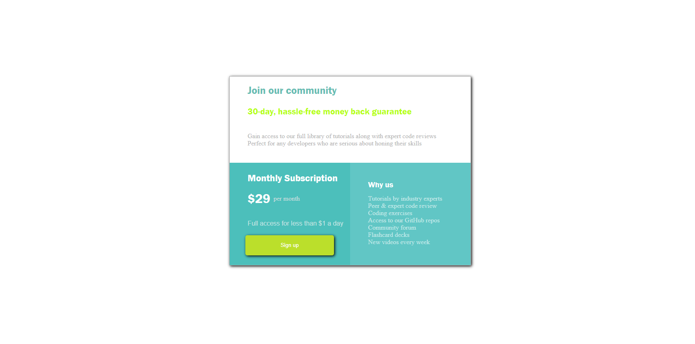
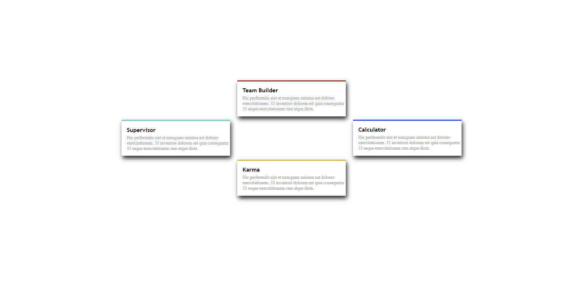
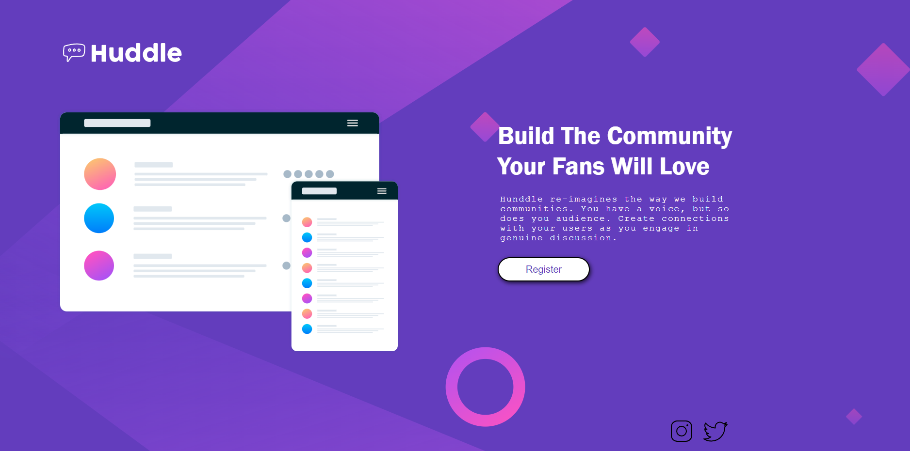

# FrontEnd-Projects
Projetos simples para desenvolver e aprimorar minhas habilidades HTML e CSS.
Inspirados nos desafios do "devporai" https://devporai.com.br/5-projetos-frontend-para-melhorar-suas-habilidades/

# Projeto 1 - GridPrecos
 

# Projeto 2 - QuatroCards
 

# Projeto 3 - LandingPage

# Projeto 4 - CadastroEmail

